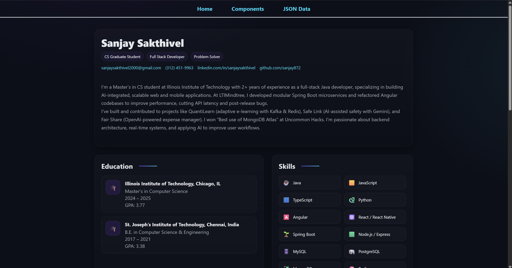
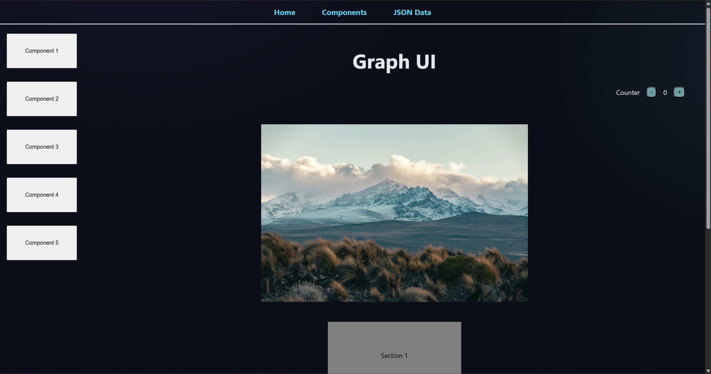
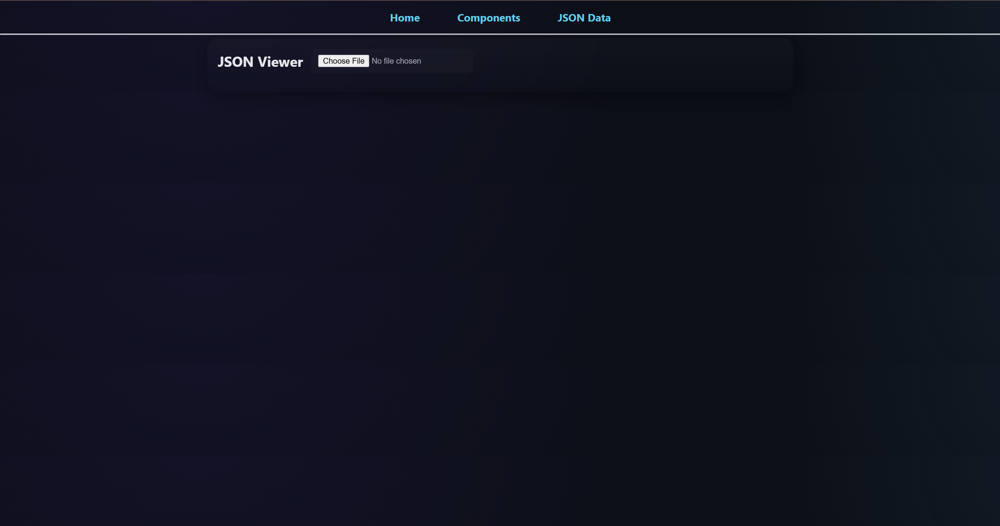
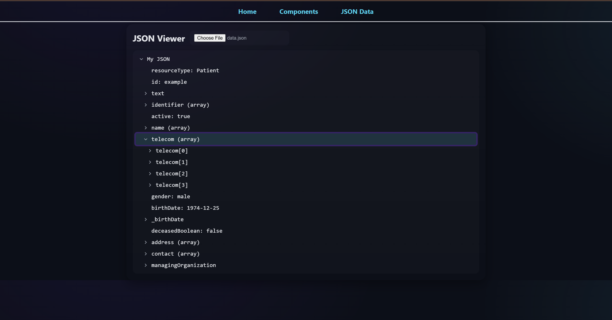

# Graph UI

The Graph UI project was developed as part of a build fellowship to demonstrate proficiency in modern front-end development with React and to explore effective methods for data visualization. The primary goal of the application is to parse and render JSON (JavaScript Object Notation) data into an intuitive, interactive tree structure.

The application serves both as a functional tool for developers and as a portfolio piece showcasing the developer's skills. It is organized into three distinct sections: a personal portfolio, a component library, and the core JSON visualization tool.

The application is a single-page application (SPA) built with React and is divided into the following pages:

- Home Page: Serves as a personal portfolio, introducing the developer and their work.

- Components Page: A collection of UI components and tasks that were developed during weekly sprints, demonstrating iterative progress and a variety of skills.

- JSON Data Page: The main feature of the application. This page provides an interface for users to input a JSON object. Upon submission, the application parses the data and displays it in a hierarchical tree view, allowing for easy exploration of nested objects and arrays.

## Technology Stack
- Framework/Library: React.js

- Language: TypeScript

- UI Components: Material-UI (MUI X) for the Tree View

## Output

### Home Page


### Components Page


### Json Data Page
#### Input

#### Output


## Setup
```bash
cd graph_ui
npm install
npm start
```

## Future Improvements

### Current Implementation Analysis

The current implementation successfully uses the MUI X Tree View component to render JSON. This approach is effective for moderately complex, well-structured data. However, a key limitation emerges when handling JSON objects with significant depth and complexity. The linear, expandable list format can become unwieldy and difficult to navigate, as the user must manually expand many nodes to understand the overall data structure, potentially leading to a cluttered and confusing user experience.

### Recommended Improvements
To address the scalability limitations of the current view, a future update should focus on transitioning from a list-based tree to a true graphical node-based visualization. This enhancement would represent the data as an actual tree graph, offering a more powerful and intuitive way to explore complex data relationships.
Key features of this proposed enhancement would include:
- Graphical Tree Structure: Displaying data as interconnected nodes and edges rather than a nested list. This provides a clear, top-down view of the entire data hierarchy at a glance.
- Color-Coding: Assigning distinct colors to different data types (e.g., strings, numbers, Booleans, objects) or nesting levels. This would act as a powerful visual cue, allowing for rapid data identification and differentiation.
- Enhanced Interactivity: Implementing features like zooming, panning, and dragging the canvas to give users complete control over their view of large and complex datasets.
Implementing these changes will significantly improve the application's utility, transforming it from a simple renderer into a powerful analytical tool for developers working with complex JSON APIs and data structures.